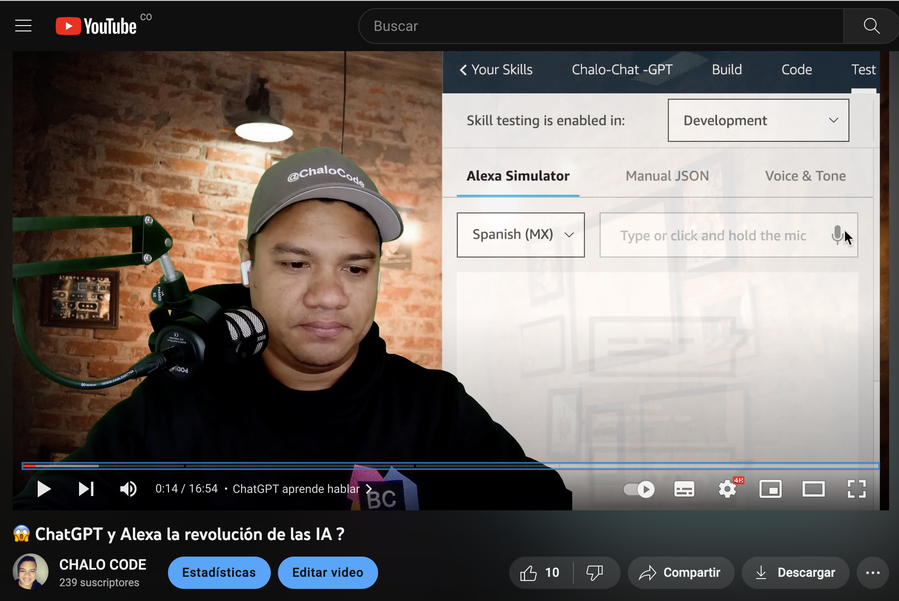
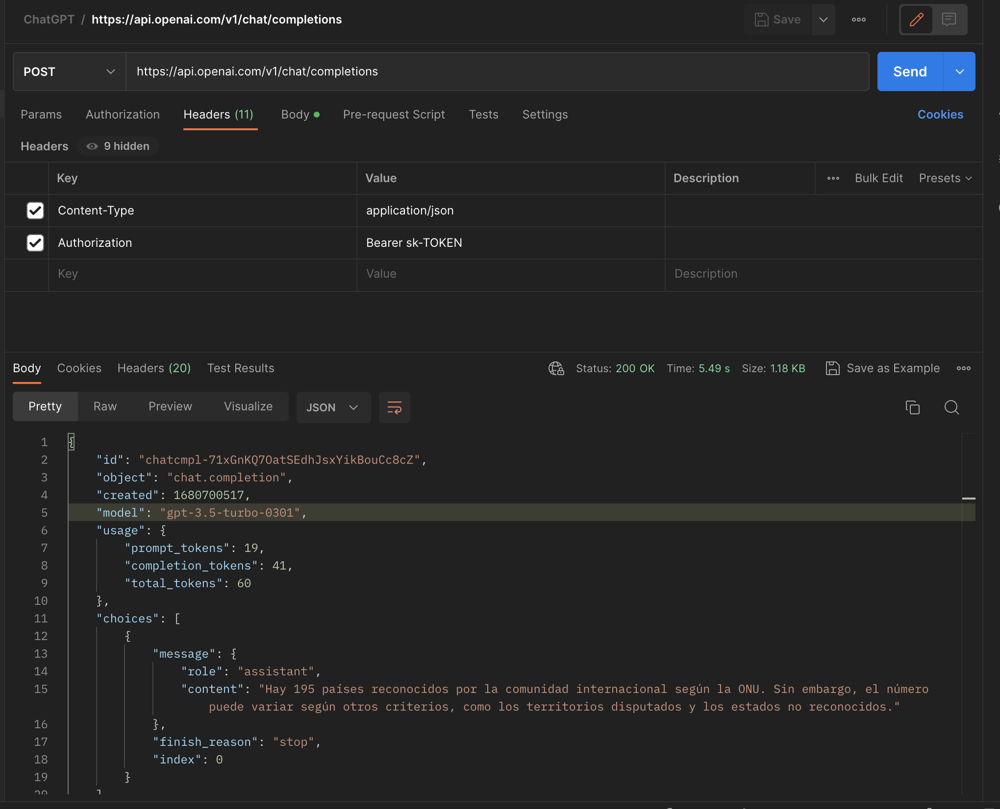
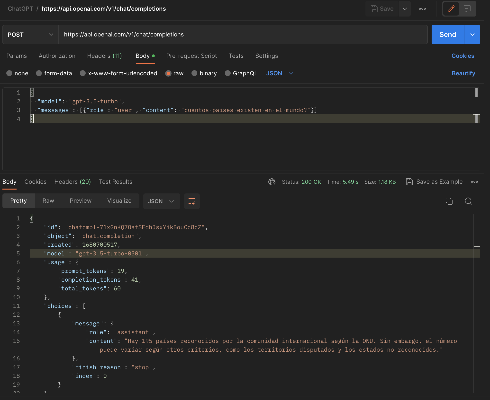

# ChatGPT APi conectado con Alexa-Skills

> Aprende ChatGPT usando el SDK de NodeJS , como también el manejo  API - REST. Luego con este conocimiento lo usaremos para conectar ChatGPT con  Alexa Skills.

## Video explicación - youtube

## POSTMAN - EJEMPLO

[]
[]
